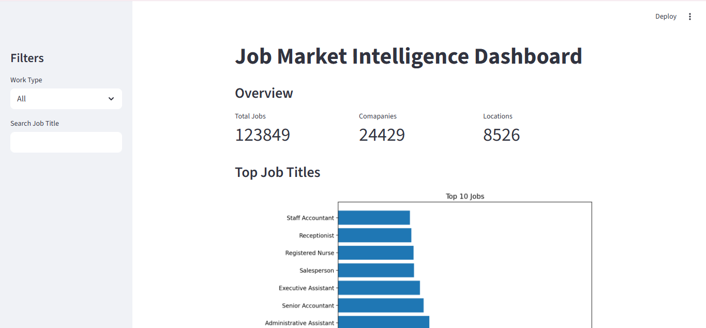
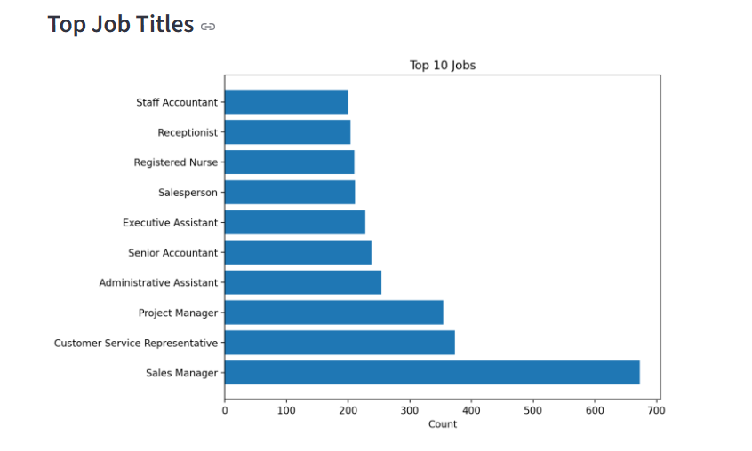
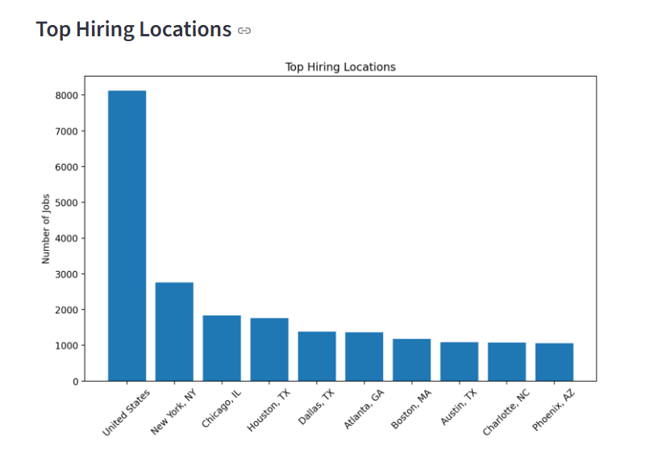
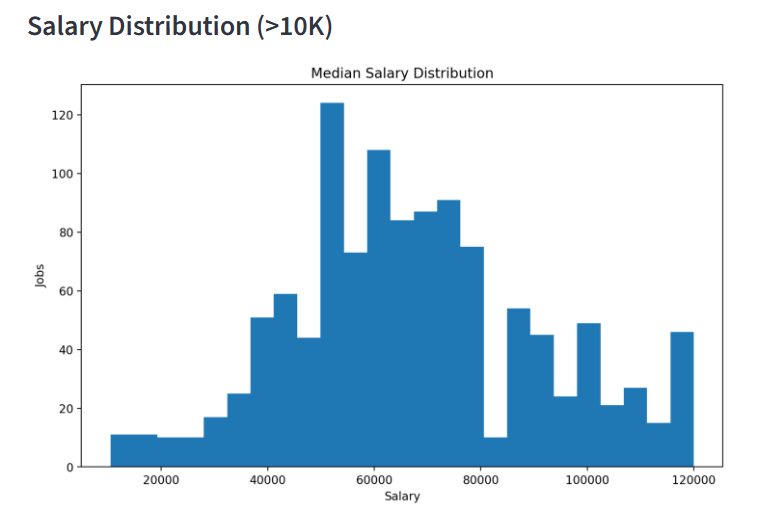
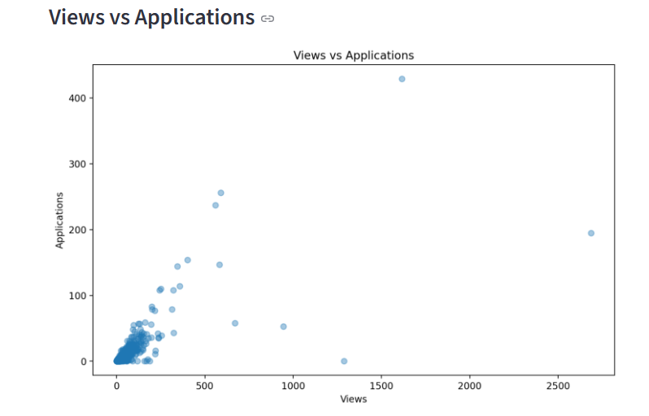
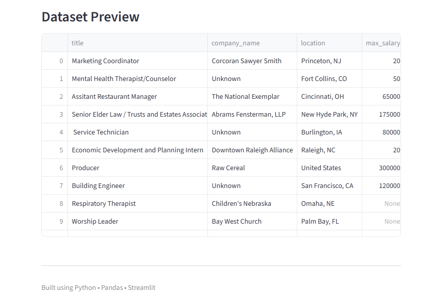
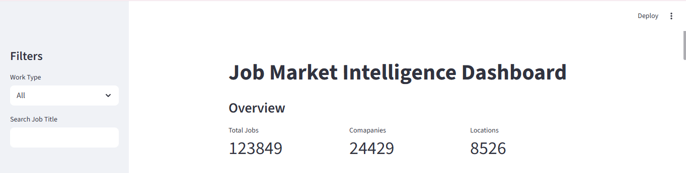

# Job Market Intelligence Dashboard

Interactive dashboard built using Python and Streamlit to analyze job trends, salary distributions, hiring locations, and engagement patterns from job listing data.

---

## Features

- Data cleaning using pandas
- Job title analysis
- Hiring location analysis
- Work type distribution
- Salary distribution analysis
- Views vs Applications analysis
- Interactive dashboard filters
- Dataset preview

---

## Tech Stack

- Python
- pandas
- Matplotlib
- Streamlit
- JupyterLab

---

## Run Locally

Clone the repository:

```bash
git clone YOUR_REPOSITORY_LINK
```

Move into project folder:

```bash
cd Job-Market-Dashboard
```

Install required packages:

```bash
pip install -r requirements.txt
```

Run dashboard:

```bash
streamlit run dashboard.py
```

---

## Dashboard Preview

### 1. Overview



---

### 2. Top Job Titles



---

### 3. Top Locations



---

### 4. Work Type Distribution


---

### 5. Salary Distribution



---

### 6. Views vs Applications



---

### 7. Dataset Preview



---

### 8. Full Dashboard



---

## Key Insights

- Identified the most demanded job roles.
- Analyzed locations with highest hiring activity.
- Explored salary trends across job postings.
- Compared job views and application engagement.
- Visualized employment type distribution.

---

## Project Structure

## Project Structure

```text
Job-Market-Dashboard/
│
├── dashboard.py
├── clean_jobs.csv
├── jobs.csv
│
├── screenshots/
│   ├── overview.png
│   ├── jobs.png
│   ├── locations.png
│   ├── work_type.png
│   ├── salary.png
│   ├── views.png
│   ├── preview.png
│   └── dashboard.png
│
├── 01_data_cleaning.ipynb
├── 02_analysis.ipynb
├── requirements.txt
└── README.md
```

---

## Future Improvements

- Add advanced filters
- Add salary forecasting
- Add deployment analytics
- Add downloadable reports

---

## Author

Suraj Matkar

GitHub: https://github.com/SurajMatkar28

LinkedIn: https://www.linkedin.com/in/suraj-matkar-b97858354/